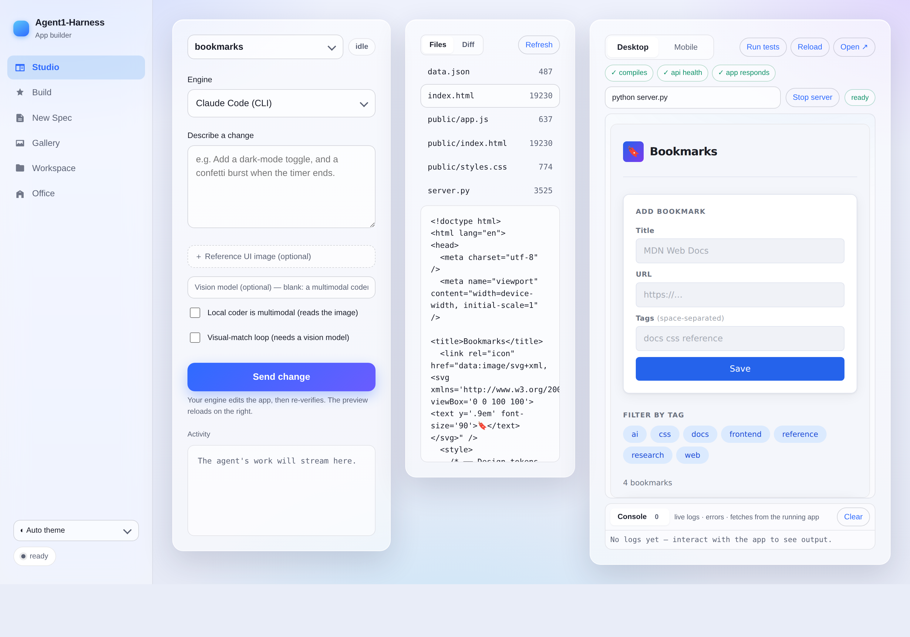
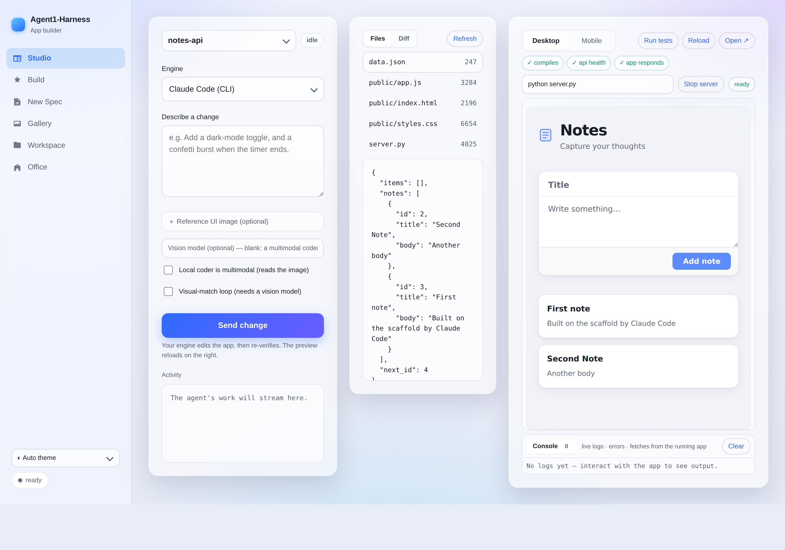

# Agent1-Harness

An **agent that builds applications from a spec** — a master front-end UI
designer and a rigorous backend engineer — that runs on **your Claude Code CLI,
the Claude Agent SDK, or your own local LLM** (GLM / MiniMax / Qwen / …),
improves itself by **learning from its mistakes**, and gates every build behind
**deterministic verification + an independent reviewer/sentry**. A **Studio**
surface lets you build and iterate conversationally with a **live preview**,
Replit/Lovable-style.

```
            ┌─────────────────────────  the loop  ─────────────────────────┐
spec ─▶ implement ─▶ VERIFY (build/test/lint) ─▶ REVIEW (quality | bug-hunt) ─▶ done
   ▲          │              │ red                      │ rejected                 │
   │          └──────────────┘  repair                  └── repair ────────────────┘
 lessons  ◀───────────────────────  record what went wrong  ◀──────────────────────┘
(injected next build)
```

The model writes the code; **the harness decides when it's done** — green checks
*and* reviewer approval, not the model's say-so. Everything runs in an isolated
workspace.

## Screenshots

The build console (`appbuilder-web`) — a ChatGPT / Hermes-style app shell: a left
nav rail, a roomy content area, automatic light/dark.

**Studio (Replit / Lovable-style)** — chat to build an app, watch it render **live** on
the right, browse the files, and re-run the gate on demand. Powered by **your Claude
Code CLI** or a local LLM. This preview is a real app the Claude Code engine built and
verified end-to-end:


**Mobile preview** — the same app in a phone frame (great for responsive web / RN-web):


**Switch projects & stop a run** — a project switcher jumps between built apps without
leaving Studio, and a **Stop** button cancels an in-flight build/iteration (it kills the
engine turn immediately for changes):


**Version history & diffs** — every build/iteration is snapshotted. Flip to **Diff** to see
exactly what a change did (colorized unified diff), and **Restore** any earlier version:


**Devtools console** — the previewed app's own `console.*`, errors, and fetches stream into a
panel under the preview, so you can debug as you test (here: a complex app's lifecycle logs):


**Theme switcher + A↔B diff** — Auto / Light / Dark glass, or opaque Solid themes; compare any
two versions:


### A complete app, built end-to-end by the harness

**Streak** — a premium habit tracker the Claude Code engine built from a single prompt
(splash → onboarding → home → stats → settings), verified, and snapshotted. ~85 KB of
hand-quality HTML/CSS/JS, no libraries:

| Splash | Onboarding | Home | Stats |
|---|---|---|---|
|  |  |  |  |

**The polished SVG-ring Pomodoro timer** the engine generated and verified, then iterated:


**Build tab** — pick spec/engine, toggle gates (review, test-first, approval), set budgets:


**Office (3D)** — a futuristic three.js scene where a little agent character works at a desk next to an **AI rig** (GPU rack). The fans spin and the GPU cards light up cyan whenever the frontier model or your local LLM is working; the whole scene animates live with the pipeline (idle → building → passed/failed):


**Color-coded live log + budget meters** — passes/failures/gates at a glance, with live token & time budget bars:


**Live Workspace view** — watch files appear/change as the agent works, with a file viewer and live preview:


**Gallery** — browse built apps; the built app previews live in an embedded iframe:


**New Spec** — author, validate, and save a spec from the UI:


**An app built by the loop** (the Quick Notes demo, verified end-to-end):


## What's inside

| Capability | Module | Notes |
|---|---|---|
| **Verification gate** | `harness/verifier.py` | Runs build/test/lint; structured pass/fail. LLM-free, unit-tested. |
| **Full-stack verification** | `harness/stacks.py` + `harness/fullstack.py` | Stack-aware default checks (node: install/build/`tsc`/eslint/tests; python: install/`pytest`; static: structure) **plus server-backed checks** marked `needs_server` — the harness boots the dev server, substitutes `$APP_URL`, runs a smoke/e2e/contract check against the **running** app, then stops it. Failures attach the server log tail. Ships a Playwright e2e template (`checks/e2e_smoke.mjs`). |
| **Reviewer / Sentry gate** | `harness/review.py` | Independent fresh-context agent(s) return a JSON verdict — `quality`, `bugs` (Sentry-style), or `a11y`. Run one (`--review`) or a **parallel panel** (`--review-panel quality,bugs,a11y`); the build passes only if **no** reviewer reports a blocker/major. |
| **Learn from itself** | `harness/memory.py` | Distills failures + reviewer findings into lessons (JSONL), injected into future builds. |
| **The loop** | `harness/agent.py` | Engine-agnostic: implement → verify → review → repair. **Diff-aware repair** (shows the last change's diff + failure delta) and **stall escalation** (a fresh-context fixer, optionally a stronger model). |
| **Test-first (red→green)** | `harness/testfirst.py` | `--test-first` derives the verification suite from the spec before building, then drives the build to green against it. |
| **Isolation** | `harness/isolation.py` | `directory` (default) or `worktree` (a git worktree off a base repo). |
| **Exec sandbox** | `harness/sandbox.py` | Commands run on the `--sandbox host` (default) or in a throwaway `--sandbox docker` container with the workspace bind-mounted. |
| **Approval gates** | `harness/approval.py` | `--approve-plan` / `--approve-build` pause for human sign-off (stdin in the CLI, or an Approve/Reject banner in the console). Rejecting **with a message** feeds it back as a targeted repair and the loop continues; a message-less rejection stops. |
| **Telemetry & budgets** | engines + `agent.py` | Tokens + wall-clock per build; `--token-budget` / `--deadline` stop the loop when exceeded. The console shows **live token & time budget meters** that fill as the build runs (amber near the limit, red over). |
| **Resumable builds** | `harness/checkpoint.py` | `--checkpoint PATH` writes a checkpoint each round; `--resume PATH` continues against the existing workspace (cumulative tokens/time carried forward). The console writes one automatically and shows a **Resume** button in the Gallery. |
| **Live run controls** | `harness/control.py` | **Pause** or **Cancel** a running build from the console; the loop stops at the next round boundary. Pause leaves a checkpoint, so it's resumable. |
| **3D Office** | `webui/office.js` (three.js) | A futuristic Office tab: an agent character works at a desk beside an **AI rig** whose fans spin and GPU cards glow cyan while a model runs. Animates with build state (idle / building / passed / failed), driven live by `/api/current`. three.js is vendored for offline use. |
| **CI** | `.github/workflows/ci.yml` | Runs the full test suite on Python 3.10–3.12 on every push and PR. |
| **Milestone planner** | `harness/planner.py` | For big apps, `--plan` first asks the engine for an ordered plan (schema → API → UI → integration), then drives **each milestone to green** before the next — each is its own build/verify/repair loop with fresh context, sharing the workspace. Per-milestone checks (incl. server-backed); the final milestone is gated on the full app suite; stops at the first failed milestone. |
| **Scaffolds** | `harness/scaffolds.py` | Start from a known-good base instead of cold: `static` (vanilla SPA), `python-api` (stdlib full-stack: JSON API + frontend, zero deps), `vite-react` (Vite+React+TS), `fastapi` (FastAPI+SQLite). The scaffold sets the run command + verification; the agent edits a working, runnable app. `--scaffold` / Studio "Start from". |
| **Runtime (live full-stack preview)** | `harness/runtime.py` | Runs the project's real dev server (`npm run dev`, `uvicorn`, or a static server — auto-detected), allocates a port, health-checks it, and **reverse-proxies the Studio preview to it** (same-origin, so the devtools console works on the live app). Server stdout/stderr stream into the console. One live server at a time; `--preview`-style controls in Studio (Run / Stop). |
| **Studio (live preview)** | `harness/server.py` + `webui/studio.js` | A Replit/Lovable-style surface: describe an app → it builds → **live preview** (Desktop / Mobile device frame, reload, open) with a **Run tests** chip; then **chat to iterate** (`/api/iterate` runs one engine turn on the workspace and re-verifies). A **project switcher** jumps between built apps, a **Stop** button cancels a run, and **version history + diffs** (`harness/versions.py`) snapshot every turn so you can review the colorized diff and **Restore** any version. Freeform prompts become first-class specs. |
| **Engines** | `harness/engines/` | `anthropic` (Claude Agent SDK), `local` (any OpenAI-compatible server — GLM / MiniMax / Qwen / …), or **`claude-cli`** — drives your installed, authenticated **Claude Code CLI** as the builder (no API key/SDK needed). |
| **Vision (image → UI)** | `harness/vision.py`, `harness/screenshot.py` | Reference a UI screenshot when building. **Two-stage:** a local **vision** model writes a design brief injected into the **coder**'s prompt. **Direct:** a multimodal coder reads the image — Claude Code reads the staged file, or a local VL model gets it inline (`--multimodal`). **Visual-match loop** (`--visual-check`): screenshot the build, vision-compare to the reference, repair the differences. CLI flags + Studio upload/toggles. |
| **Personas** | `harness/personas.py` | Specialist system prompts by `kind`: frontend design, backend rigor, **React/React Native**, **SwiftUI (Apple-level)**. |
| **Web console** | `harness/server.py` + `webui/` | Tabs: Build, **New Spec** (author specs), **Gallery** (preview built apps), and a **live Workspace view** (watch files appear/change as the agent works). Stdlib only. See `docs/screenshots/`. |
| **Design checks** | `checks/` | Headless Playwright + axe-core + Lighthouse, wired as verification commands. |

## Self-improving loop, in one command

```bash
# Build with Claude, sentry bug-hunt gate, and learning enabled
export ANTHROPIC_API_KEY=sk-ant-...
appbuilder specs/todo-cli.yaml -w workspaces/todo \
    --review --review-focus bugs --learn

# Same loop on a local model via Ollama
appbuilder specs/landing-page.yaml -w workspaces/landing \
    --engine local --base-url http://localhost:11434/v1 --model qwen2.5-coder \
    --review --learn

# Isolate the build in a git worktree off the current repo
appbuilder specs/todo-cli.yaml -w /tmp/wt --isolation worktree --base-repo . --cleanup

# No model, no key — just run the verification gate
appbuilder specs/web-dashboard.yaml -w workspaces/dash --check-only
```

Flags: `--engine {anthropic,local}`, `--model`, `--base-url`, `--review`,
`--review-focus {quality,bugs}`, `--reviewer-model`, `--learn`, `--memory PATH`,
`--isolation {directory,worktree}`, `--base-repo`, `--cleanup`,
`--max-repairs`, `--max-turns`, `--check-only`, `--no-echo`.

## Web console

```bash
appbuilder-web            # http://127.0.0.1:8765
```

Pick a spec, choose engine/model, toggle the reviewer/sentry gate and learning,
and watch the build stream live (SSE). The UI itself dogfoods the design
persona — a ChatGPT / Hermes-style sidebar shell, a cohesive token system,
automatic light/dark, keyboard focus, and reduced-motion support.

## Studio — build & iterate like Replit / Lovable

The **Studio** tab is the conversational surface:

1. **Describe** the app (or pick a kind). The harness builds it, then **verifies** it.
2. **Watch it live** in the preview pane — toggle **Desktop / Mobile** (a phone frame),
   reload, or open in a new tab. Hit **Run tests** to re-run the gate any time.
3. **Chat to iterate** — "add a dark-mode toggle", "make the ring teal". Each message
   runs one engine turn against the workspace and re-verifies; the preview reloads.
4. **Switch & stop** — the project switcher jumps between built apps without leaving
   Studio; **Stop** cancels an in-flight run (immediately killing the engine turn for a
   change). Reloading the page mid-run re-attaches to the live job.
5. **History & diff** — every turn is snapshotted. The **Diff** tab shows a colorized
   per-version diff of what changed, and **Restore** rolls back to any earlier version
   (non-destructively — the current state is saved first).
6. **Run the real stack** — for full-stack apps, hit **Run server** (auto-detects `npm run
   dev` / `uvicorn` / a static server, or type your own). The preview proxies to the live
   dev server, the status pill goes green when it's healthy, and the server's logs stream
   into the Console alongside the browser logs. *(Naive HTTP proxy: WebSocket HMR and
   absolute-asset SPAs may need "Open ↗" to the direct port; SSR/API/relative-asset apps
   proxy cleanly.)*

The console wears a modern **glassmorphic** theme: a soft gradient-mesh backdrop,
translucent frosted cards, and a gradient-accent primary — premium, with automatic
light/dark and reduced-motion support.

Choose your engine right in Studio:

- **Claude Code (CLI)** — drives your installed, authenticated `claude` CLI. No API key,
  no SDK; *literally* plugging Claude Code in as the builder. (Set `$CLAUDE_CLI_BIN` to
  point at a non-default binary.)
- **Local** — any OpenAI-compatible server (Ollama / LM Studio / vLLM). Presets for
  **GLM**, **MiniMax**, and **Qwen Coder**; the model id + base URL are editable to match
  whatever your server exposes.

```bash
# Same thing from the CLI — build with your Claude Code login as the engine:
appbuilder specs/landing-page.yaml -w workspaces/landing --engine claude-cli

# …or a local model:
appbuilder specs/landing-page.yaml -w workspaces/landing \
    --engine local --base-url http://localhost:11434/v1 --model glm-4
```

### Plan a big app in milestones

One giant implement turn is brittle for large apps. With `--plan` (or Studio's "Plan
milestones"), the harness asks the engine for an ordered plan, then drives **each
milestone to green** before the next — each milestone is its own build/verify/repair
loop (fresh context), and they share the workspace so later milestones build on earlier
ones. The final milestone is gated on the full app suite.

```bash
appbuilder specs/app.yaml -w ws/app --engine claude-cli --scaffold python-api --plan
```

Verified live: a planned full-stack **bookmarks** build on the `python-api` scaffold
decomposed into 2 milestones and converged —

```
======== plan: 2 milestone(s) ========
======== milestone 1/2: Bookmark API ========
[PASS] compiles · [PASS] api health · [PASS] app responds   → milestone 1 PASSED
======== milestone 2/2: Frontend UI ========
[FAIL] app builds → agent self-corrects → [PASS] app builds · [PASS] app responds
RESULT: PASSED
```

…producing a working app (add bookmark, filter-by-tag, JSON API + disk storage):



### Start from a scaffold

Cold-generating a whole app is error-prone; **scaffolds** give the agent a working,
runnable base to edit. Pick one in Studio ("Start from") or `--scaffold`:

| Scaffold | Stack | Runs offline |
|---|---|---|
| `static` | Vanilla HTML/CSS/JS SPA (no build) | ✅ |
| `python-api` | Stdlib full-stack: JSON API + frontend, file storage, **zero deps** | ✅ |
| `vite-react` | Vite + React + TypeScript | needs `npm i` |
| `fastapi` | FastAPI + SQLite | needs `pip i` |

The scaffold owns the run command + verification, so the full-stack gate has a real
toolchain immediately. Verified here: from the `python-api` scaffold + one prompt, the
Claude Code engine built a **Notes app with a real `/api/notes` CRUD** (GET/POST/DELETE,
JSON-file storage) and a frontend — and the server-backed gate passed
(`✓ compiles · ✓ api health · ✓ app responds`):



### The gate runs the real app

Beyond static checks, the harness can verify the **running** app. Default suites are
stack-aware, and any check marked `needs_server` runs against a live dev server (the
harness boots it, fills in `$APP_URL`, then tears it down):

```yaml
run: npm run dev                      # or uvicorn app:app --port $PORT (auto-detected too)
verification:
  - { name: build,    command: npm run build }
  - { name: types,    command: npx tsc --noEmit }
  - { name: api ok,   command: "curl -fsS $APP_URL/api/health", needs_server: true }
  - { name: e2e,      command: "node ../../checks/e2e_smoke.mjs", needs_server: true }
```

```bash
# Build a full-stack app and gate it on the running server + e2e
appbuilder specs/app.yaml -w ws/app --engine claude-cli --run "npm run dev"
```

Verified here on a built app: the gate booted the dev server and the smoke check hit it —
`[PASS] app builds` · `[PASS] app responds` → **GATE PASSED**.

> **Native mobile (RN / SwiftUI):** the in-browser preview covers web and
> responsive/RN-web in a phone frame. True React Native and SwiftUI builds still need
> their native toolchains (Node/Expo, macOS/Xcode) to *run* — the harness drives the
> build the same way everywhere; only the run/preview surface differs.

## Match a reference UI from an image (vision)

Drop a screenshot of a UI you like and the harness will build to match it. Two paths
(`harness/vision.py`, `--reference-image`, or the Studio "Reference UI image" upload):

1. **Two-stage (recommended, fully local):** a **vision** model (e.g. `qwen2.5-vl`,
   `llava`, `minicpm-v` on your local server) writes an implementation-ready *design
   brief* from the image; that brief is injected into the prompt for a strong, dedicated
   **coder** model (e.g. `qwen2.5-coder`). Each model is specialised → best quality.
   Set a Vision model in Studio, or `--vision-model qwen2.5-vl --vision-base-url …`.
2. **Single multimodal model:** one vision+code model reads the image directly (no separate
   describe step). The **Claude Code** engine reads the staged file; a **local** vision-capable
   model gets the image attached to its first turn with `--multimodal`.

3. **Visual-match loop (`--visual-check`):** after building, the harness screenshots the result
   with a headless Chromium, asks the vision model how it differs from the reference, and feeds
   those differences back as a repair — up to `max_visual_repairs` times. Closes the loop on
   visual fidelity. (`harness/screenshot.py` + `vision.compare_ui`.)

```bash
# Two-stage + visual-match loop: vision model describes & QAs, coder builds
appbuilder specs/app.yaml -w ws/app --engine local --model qwen2.5-coder \
    --reference-image design.png --vision-model qwen2.5-vl --visual-check

# Single local multimodal model reads the image itself
appbuilder specs/app.yaml -w ws/app --engine local --model qwen2.5-vl \
    --reference-image design.png --multimodal
```

Below: from a single prompt **plus the Streak home screen as a reference image**, the
Claude Code engine built a *different* app (a water tracker) that adopts the reference's
visual language — warm background, left-accent cards, emoji headers, the circular ring,
the 🔥 streak with weekly dots, and the bottom tab bar:


## Native targets — React Native & SwiftUI

The persona for `kind: react-native` enforces typed components, design tokens,
native feel, and a11y; `kind: swiftui` enforces HIG, VoiceOver/Dynamic Type,
light+dark, and idiomatic state. Example specs: `specs/react-native-app.yaml`,
`specs/swiftui-app.yaml`.

> Quality is only as strong as the verification you give it. Make the gate real:
> React/RN → `tsc --noEmit`, `eslint`, `vitest`/`jest`; SwiftUI → `swift test`
> or `xcodebuild test`. **SwiftUI builds require a macOS/Xcode toolchain**, and
> React Native builds require Node — those commands won't run on a bare Linux
> box; the harness logic is the same everywhere, only the toolchain differs.

## Design as a hard gate

`specs/landing-page.yaml` verifies design tokens, responsive `@media`, semantic
landmarks, and a single `<h1>` with stdlib Python (runs anywhere). For richer
checks, `specs/web-dashboard.yaml` wires the `checks/` scripts:

```yaml
verification:
  - name: a11y
    command: "node ../../checks/a11y_audit.mjs index.html"   # axe-core, fails on critical/serious
  - name: lighthouse
    command: "node ../../checks/lighthouse_audit.mjs index.html"   # score budgets
```

See `checks/README.md` (needs Node + Chromium).

## Robustness model

- **Deterministic gate, not vibes** — verification runs between turns; the agent can't self-declare success.
- **Independent second opinion** — the reviewer/sentry runs in a *fresh* engine context and reads the code itself.
- **Bounded autonomy** — separate repair budgets for verification and review; capped agentic turns.
- **Isolation** — builds land in an ephemeral dir or a throwaway git worktree; `git push` is blocked inside the sandbox.
- **Reviewable output** — work is a diff you inspect; nothing is pushed.

## Running on a Mac (Mac Studio / any Apple Silicon or Intel Mac)

One command sets everything up in a local `.venv` and tells you exactly how to connect:

```bash
git clone <repo> && cd Agent1-Harness
./scripts/install-mac.sh                 # Python venv + harness + local engine
./scripts/start-mac.sh                   # opens http://127.0.0.1:8765 in your browser
```

Optional add-ons (skip if you already have them):

```bash
./scripts/install-mac.sh --with-claude    # also install the Claude Code CLI
./scripts/install-mac.sh --with-ollama    # also install Ollama + pull qwen2.5-coder
./scripts/install-mac.sh --with-menubar   # also build a ✦ menu-bar app
```

Prefer not to touch the Terminal? Two clickable options:
- **`Agent1-Harness.command`** — double-click in Finder; first run installs, later
  runs just launch the console + open the browser.
- **`Agent1-Harness.app`** (from `--with-menubar`, or `./scripts/make-app.sh`) — a
  ✦ menu-bar app to start/stop the console, open it, and run the engine doctor;
  drag it to /Applications.

At the end the installer runs **`python -m harness.doctor`**, which probes the
machine and prints which engines are ready and the exact command to use. Run it
anytime to see what's connected.

### Connect Claude Code (easiest — no API key)

If you have the authenticated `claude` CLI, the harness drives it directly:

```bash
npm install -g @anthropic-ai/claude-code   # once (or: ./scripts/install-mac.sh --with-claude)
claude                                      # sign in once
```

Then in the **Studio** tab pick engine **“Claude Code (CLI)”** (it's the default),
or on the CLI: `--engine claude-cli --model sonnet`. No `ANTHROPIC_API_KEY` needed.
(To use the API instead: `export ANTHROPIC_API_KEY=…` and pick **Claude**.)

### Connect a local LLM (fully offline — great on a Mac Studio)

Apple-Silicon unified memory runs strong coder models locally. Use **Ollama** or
**LM Studio** — anything OpenAI-compatible with **tool-calling** works:

```bash
brew install ollama && ollama serve        # (or ./scripts/install-mac.sh --with-ollama)
ollama pull qwen2.5-coder                   # a solid tool-calling coder; 32B if you have the RAM
```

In **Studio** choose engine **“Local”** and set the model (e.g. `qwen2.5-coder`);
the endpoint defaults to Ollama (`http://localhost:11434/v1`). LM Studio? use
`http://localhost:1234/v1`. On the CLI:

```bash
appbuilder spec.yaml --workspace ./out \
  --engine local --base-url http://localhost:11434/v1 --model qwen2.5-coder
```

`python -m harness.doctor` lists the models it can see so you know exactly what to type.

> Want native builds too? A Mac can also build/verify **SwiftUI/iOS** (needs Xcode)
> and **Expo/React Native** (needs Node) — toolchains the harness drives but doesn't bundle.

## Setup & tests

```bash
pip install -e .            # Claude engine
pip install -e ".[local]"   # + local-LLM engine (openai client)
pip install -e ".[dev]"     # + tests
pytest                      # offline test suite; no API key, no network
```

The trust-critical pieces (verifier, spec, isolation, memory, review parsing,
the loop via a fake engine, the web helpers) are fully unit-tested offline. The
two live model paths need a key or a local server to exercise end-to-end.

## Layout

```
harness/
  verifier.py spec.py personas.py prompts.py        # spec + gates + prompts (LLM-free core)
  memory.py review.py isolation.py                   # learning, reviewer gate, isolation
  permissions.py localtools.py tools.py             # sandbox + tools
  config.py agent.py cli.py server.py               # config, the loop, CLIs, web console
  engines/ base.py anthropic_engine.py local_engine.py
webui/        index.html styles.css app.js          # clean build console
specs/        todo-cli, landing-page, web-dashboard, react-native-app, swiftui-app
checks/       a11y_audit.mjs lighthouse_audit.mjs   # design gate templates
tests/        verifier, spec, localtools, personas, isolation, memory, review, loop, server
```

## Next steps

- Container isolation (Docker) in addition to worktrees.
- A reflection step that asks the model to summarize its own lessons (richer than the mechanical distillation).
- Persisted plan artifacts and per-file staleness checks.
- Cost/time budgets surfaced from engine usage and enforced in the loop.
