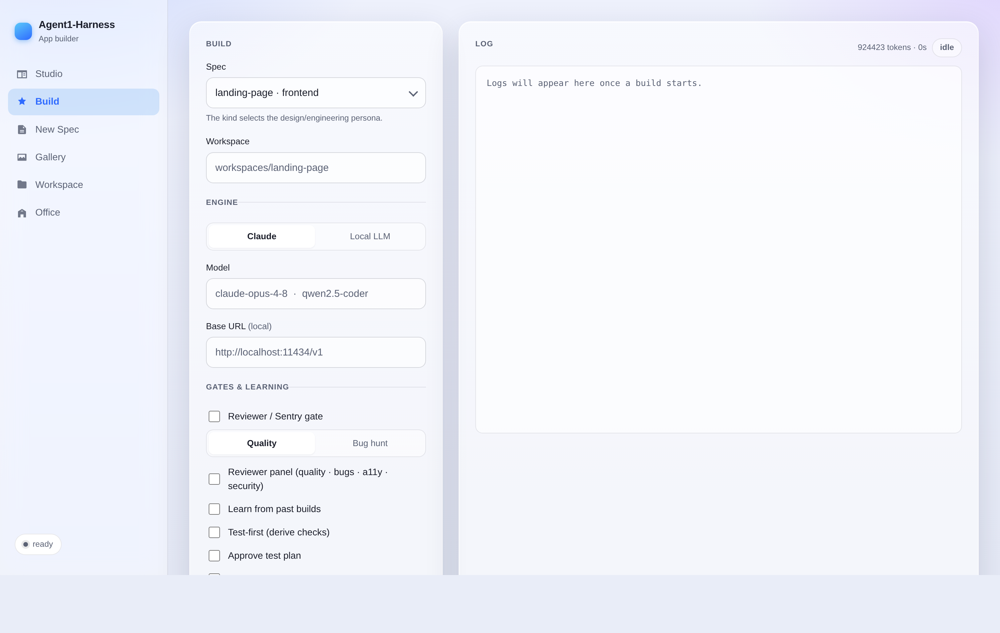
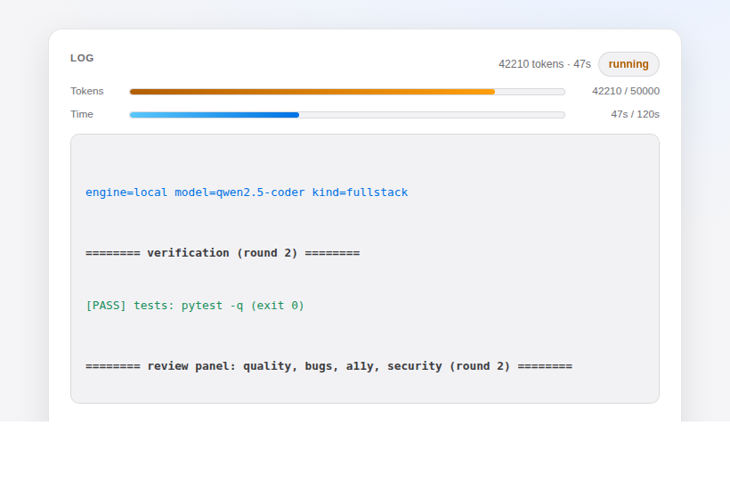
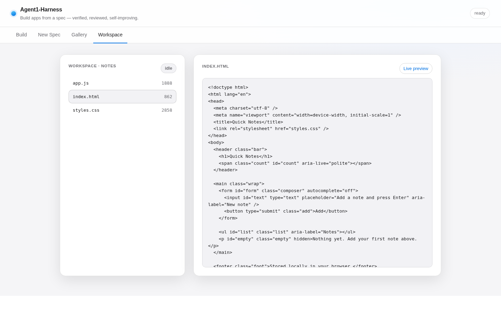
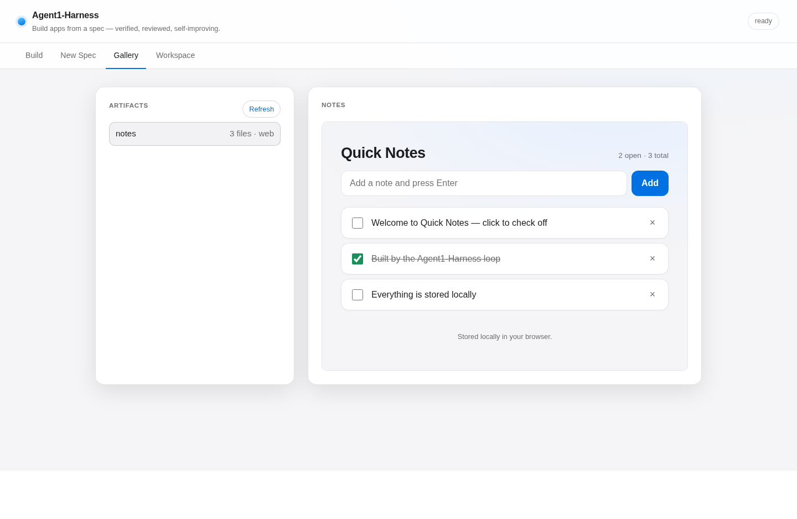
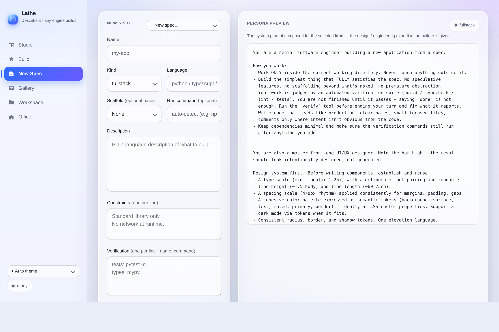
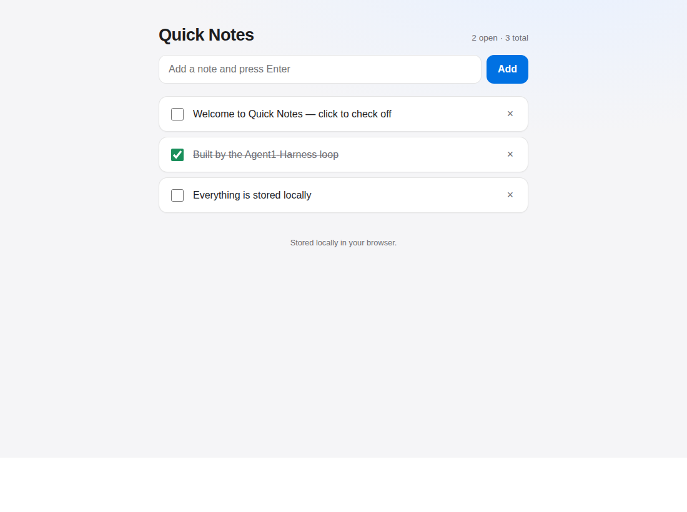

# Agent1-Harness

An **agent that builds applications from a spec** — a master front-end UI
designer and a rigorous backend engineer — that runs on **Claude or your own
local LLM**, improves itself by **learning from its mistakes**, and gates every
build behind **deterministic verification + an independent reviewer/sentry**.

```
            ┌─────────────────────────  the loop  ─────────────────────────┐
spec ─▶ implement ─▶ VERIFY (build/test/lint) ─▶ REVIEW (quality | bug-hunt) ─▶ done
   ▲          │              │ red                      │ rejected                 │
   │          └──────────────┘  repair                  └── repair ────────────────┘
 lessons  ◀───────────────────────  record what went wrong  ◀──────────────────────┘
(injected next build)
```

The model writes the code; **the harness decides when it's done** — green checks
*and* reviewer approval, not the model's say-so. Everything runs in an isolated
workspace.

## Screenshots

The build console (`appbuilder-web`) — clean, Apple-inspired, automatic light/dark.

**Build tab** — pick spec/engine, toggle gates (review, test-first, approval), set budgets:



**Color-coded live log + budget meters** — passes/failures/gates at a glance, with live token & time budget bars:



**Live Workspace view** — watch files appear/change as the agent works, with a file viewer and live preview:



**Gallery** — browse built apps; the built app previews live in an embedded iframe:



**New Spec** — author, validate, and save a spec from the UI:



**An app built by the loop** (the Quick Notes demo, verified end-to-end):



## What's inside

| Capability | Module | Notes |
|---|---|---|
| **Verification gate** | `harness/verifier.py` | Runs build/test/lint; structured pass/fail. LLM-free, unit-tested. |
| **Reviewer / Sentry gate** | `harness/review.py` | Independent fresh-context agent(s) return a JSON verdict — `quality`, `bugs` (Sentry-style), or `a11y`. Run one (`--review`) or a **parallel panel** (`--review-panel quality,bugs,a11y`); the build passes only if **no** reviewer reports a blocker/major. |
| **Learn from itself** | `harness/memory.py` | Distills failures + reviewer findings into lessons (JSONL), injected into future builds. |
| **The loop** | `harness/agent.py` | Engine-agnostic: implement → verify → review → repair. **Diff-aware repair** (shows the last change's diff + failure delta) and **stall escalation** (a fresh-context fixer, optionally a stronger model). |
| **Test-first (red→green)** | `harness/testfirst.py` | `--test-first` derives the verification suite from the spec before building, then drives the build to green against it. |
| **Isolation** | `harness/isolation.py` | `directory` (default) or `worktree` (a git worktree off a base repo). |
| **Exec sandbox** | `harness/sandbox.py` | Commands run on the `--sandbox host` (default) or in a throwaway `--sandbox docker` container with the workspace bind-mounted. |
| **Approval gates** | `harness/approval.py` | `--approve-plan` / `--approve-build` pause for human sign-off (stdin in the CLI, or an Approve/Reject banner in the console). Rejecting **with a message** feeds it back as a targeted repair and the loop continues; a message-less rejection stops. |
| **Telemetry & budgets** | engines + `agent.py` | Tokens + wall-clock per build; `--token-budget` / `--deadline` stop the loop when exceeded. The console shows **live token & time budget meters** that fill as the build runs (amber near the limit, red over). |
| **Resumable builds** | `harness/checkpoint.py` | `--checkpoint PATH` writes a checkpoint each round; `--resume PATH` continues against the existing workspace (cumulative tokens/time carried forward). The console writes one automatically and shows a **Resume** button in the Gallery. |
| **Live run controls** | `harness/control.py` | **Pause** or **Cancel** a running build from the console; the loop stops at the next round boundary. Pause leaves a checkpoint, so it's resumable. |
| **Engines** | `harness/engines/` | `anthropic` (Claude Agent SDK) or `local` (any OpenAI-compatible server). |
| **Personas** | `harness/personas.py` | Specialist system prompts by `kind`: frontend design, backend rigor, **React/React Native**, **SwiftUI (Apple-level)**. |
| **Web console** | `harness/server.py` + `webui/` | Tabs: Build, **New Spec** (author specs), **Gallery** (preview built apps), and a **live Workspace view** (watch files appear/change as the agent works). Stdlib only. See `docs/screenshots/`. |
| **Design checks** | `checks/` | Headless Playwright + axe-core + Lighthouse, wired as verification commands. |

## Self-improving loop, in one command

```bash
# Build with Claude, sentry bug-hunt gate, and learning enabled
export ANTHROPIC_API_KEY=sk-ant-...
appbuilder specs/todo-cli.yaml -w workspaces/todo \
    --review --review-focus bugs --learn

# Same loop on a local model via Ollama
appbuilder specs/landing-page.yaml -w workspaces/landing \
    --engine local --base-url http://localhost:11434/v1 --model qwen2.5-coder \
    --review --learn

# Isolate the build in a git worktree off the current repo
appbuilder specs/todo-cli.yaml -w /tmp/wt --isolation worktree --base-repo . --cleanup

# No model, no key — just run the verification gate
appbuilder specs/web-dashboard.yaml -w workspaces/dash --check-only
```

Flags: `--engine {anthropic,local}`, `--model`, `--base-url`, `--review`,
`--review-focus {quality,bugs}`, `--reviewer-model`, `--learn`, `--memory PATH`,
`--isolation {directory,worktree}`, `--base-repo`, `--cleanup`,
`--max-repairs`, `--max-turns`, `--check-only`, `--no-echo`.

## Web console

```bash
appbuilder-web            # http://127.0.0.1:8765
```

Pick a spec, choose engine/model, toggle the reviewer/sentry gate and learning,
and watch the build stream live (SSE). The UI itself dogfoods the design
persona — a cohesive token system, dark theme, keyboard focus, reduced-motion.

## Native targets — React Native & SwiftUI

The persona for `kind: react-native` enforces typed components, design tokens,
native feel, and a11y; `kind: swiftui` enforces HIG, VoiceOver/Dynamic Type,
light+dark, and idiomatic state. Example specs: `specs/react-native-app.yaml`,
`specs/swiftui-app.yaml`.

> Quality is only as strong as the verification you give it. Make the gate real:
> React/RN → `tsc --noEmit`, `eslint`, `vitest`/`jest`; SwiftUI → `swift test`
> or `xcodebuild test`. **SwiftUI builds require a macOS/Xcode toolchain**, and
> React Native builds require Node — those commands won't run on a bare Linux
> box; the harness logic is the same everywhere, only the toolchain differs.

## Design as a hard gate

`specs/landing-page.yaml` verifies design tokens, responsive `@media`, semantic
landmarks, and a single `<h1>` with stdlib Python (runs anywhere). For richer
checks, `specs/web-dashboard.yaml` wires the `checks/` scripts:

```yaml
verification:
  - name: a11y
    command: "node ../../checks/a11y_audit.mjs index.html"   # axe-core, fails on critical/serious
  - name: lighthouse
    command: "node ../../checks/lighthouse_audit.mjs index.html"   # score budgets
```

See `checks/README.md` (needs Node + Chromium).

## Robustness model

- **Deterministic gate, not vibes** — verification runs between turns; the agent can't self-declare success.
- **Independent second opinion** — the reviewer/sentry runs in a *fresh* engine context and reads the code itself.
- **Bounded autonomy** — separate repair budgets for verification and review; capped agentic turns.
- **Isolation** — builds land in an ephemeral dir or a throwaway git worktree; `git push` is blocked inside the sandbox.
- **Reviewable output** — work is a diff you inspect; nothing is pushed.

## Setup & tests

```bash
pip install -e .            # Claude engine
pip install -e ".[local]"   # + local-LLM engine (openai client)
pip install -e ".[dev]"     # + tests
pytest                      # 54 offline tests; no API key, no network
```

The trust-critical pieces (verifier, spec, isolation, memory, review parsing,
the loop via a fake engine, the web helpers) are fully unit-tested offline. The
two live model paths need a key or a local server to exercise end-to-end.

## Layout

```
harness/
  verifier.py spec.py personas.py prompts.py        # spec + gates + prompts (LLM-free core)
  memory.py review.py isolation.py                   # learning, reviewer gate, isolation
  permissions.py localtools.py tools.py             # sandbox + tools
  config.py agent.py cli.py server.py               # config, the loop, CLIs, web console
  engines/ base.py anthropic_engine.py local_engine.py
webui/        index.html styles.css app.js          # clean build console
specs/        todo-cli, landing-page, web-dashboard, react-native-app, swiftui-app
checks/       a11y_audit.mjs lighthouse_audit.mjs   # design gate templates
tests/        verifier, spec, localtools, personas, isolation, memory, review, loop, server
```

## Next steps

- Container isolation (Docker) in addition to worktrees.
- A reflection step that asks the model to summarize its own lessons (richer than the mechanical distillation).
- Persisted plan artifacts and per-file staleness checks.
- Cost/time budgets surfaced from engine usage and enforced in the loop.
