# Agent1-Harness

An **agent that builds applications from a spec** — a master front-end UI
designer and a rigorous backend engineer — that runs on **your Claude Code CLI,
the Claude Agent SDK, or your own local LLM** (GLM / MiniMax / Qwen / …),
improves itself by **learning from its mistakes**, and gates every build behind
**deterministic verification + an independent reviewer/sentry**. A **Studio**
surface lets you build and iterate conversationally with a **live preview**,
Replit/Lovable-style.

```
            ┌─────────────────────────  the loop  ─────────────────────────┐
spec ─▶ implement ─▶ VERIFY (build/test/lint) ─▶ REVIEW (quality | bug-hunt) ─▶ done
   ▲          │              │ red                      │ rejected                 │
   │          └──────────────┘  repair                  └── repair ────────────────┘
 lessons  ◀───────────────────────  record what went wrong  ◀──────────────────────┘
(injected next build)
```

The model writes the code; **the harness decides when it's done** — green checks
*and* reviewer approval, not the model's say-so. Everything runs in an isolated
workspace.

## Screenshots

The build console (`appbuilder-web`) — a ChatGPT / Hermes-style app shell: a left
nav rail, a roomy content area, automatic light/dark.

**Studio (Replit / Lovable-style)** — chat to build an app, watch it render **live** on
the right, browse the files, and re-run the gate on demand. Powered by **your Claude
Code CLI** or a local LLM. This preview is a real app the Claude Code engine built and
verified end-to-end:

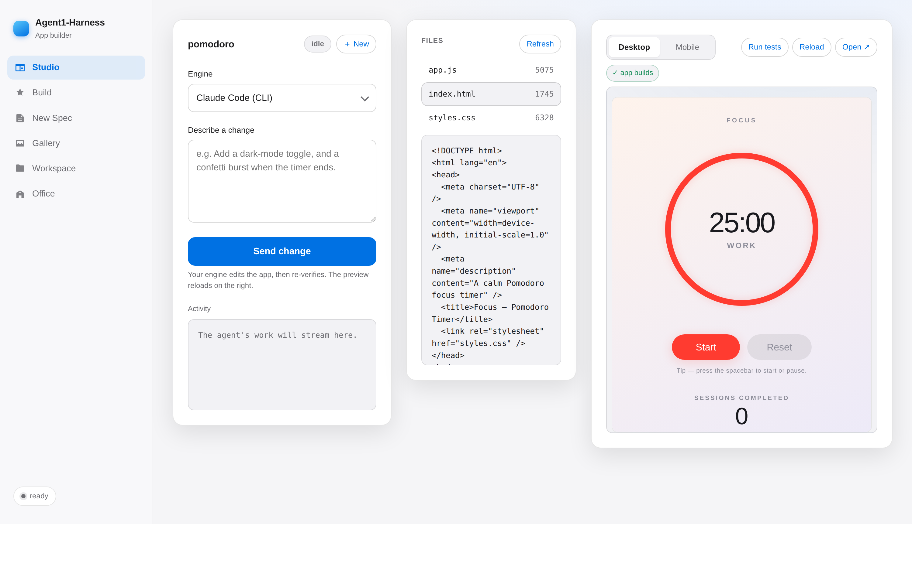

**Mobile preview** — the same app in a phone frame (great for responsive web / RN-web):

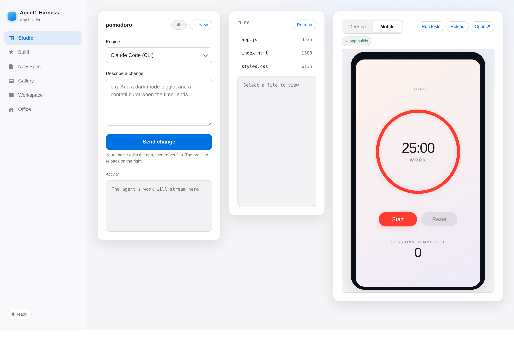

**Switch projects & stop a run** — a project switcher jumps between built apps without
leaving Studio, and a **Stop** button cancels an in-flight build/iteration (it kills the
engine turn immediately for changes):

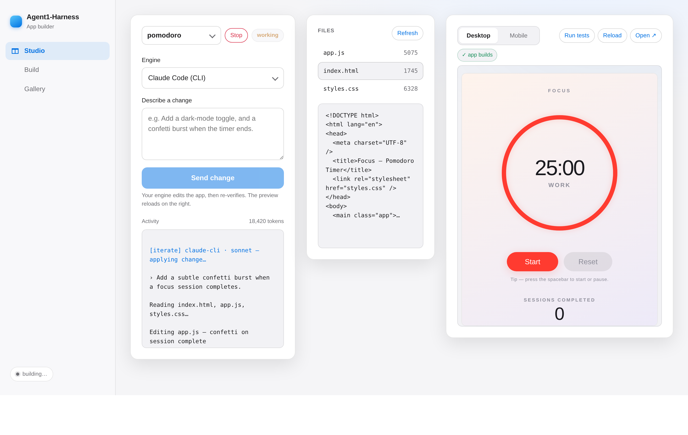

**Version history & diffs** — every build/iteration is snapshotted. Flip to **Diff** to see
exactly what a change did (colorized unified diff), and **Restore** any earlier version:

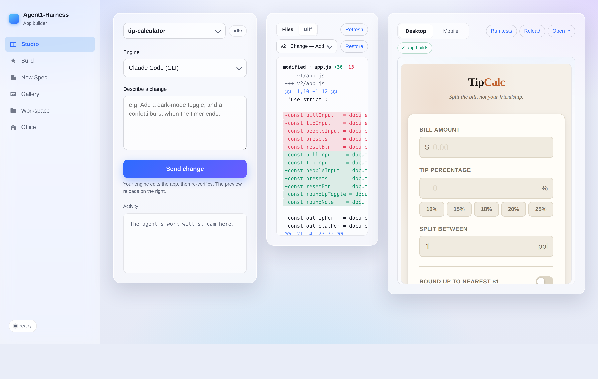

**Devtools console** — the previewed app's own `console.*`, errors, and fetches stream into a
panel under the preview, so you can debug as you test (here: a complex app's lifecycle logs):

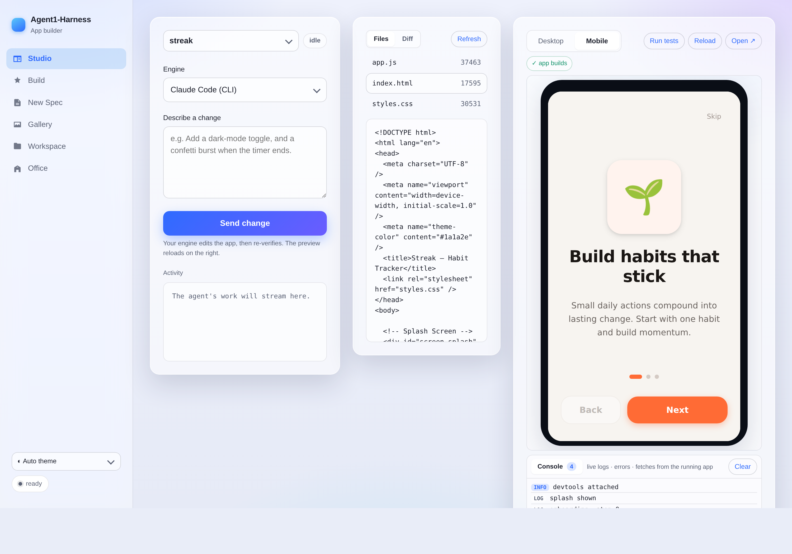

**Theme switcher + A↔B diff** — Auto / Light / Dark glass, or opaque Solid themes; compare any
two versions:

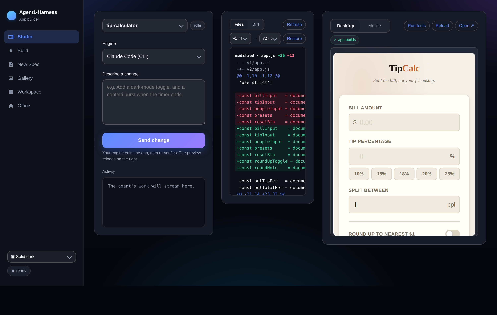

### A complete app, built end-to-end by the harness

**Streak** — a premium habit tracker the Claude Code engine built from a single prompt
(splash → onboarding → home → stats → settings), verified, and snapshotted. ~85 KB of
hand-quality HTML/CSS/JS, no libraries:

| Splash | Onboarding | Home | Stats |
|---|---|---|---|
| 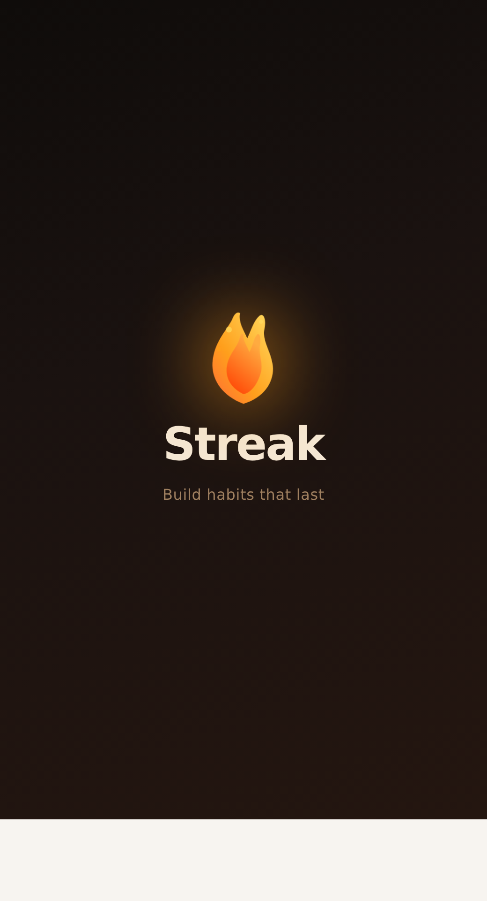 | 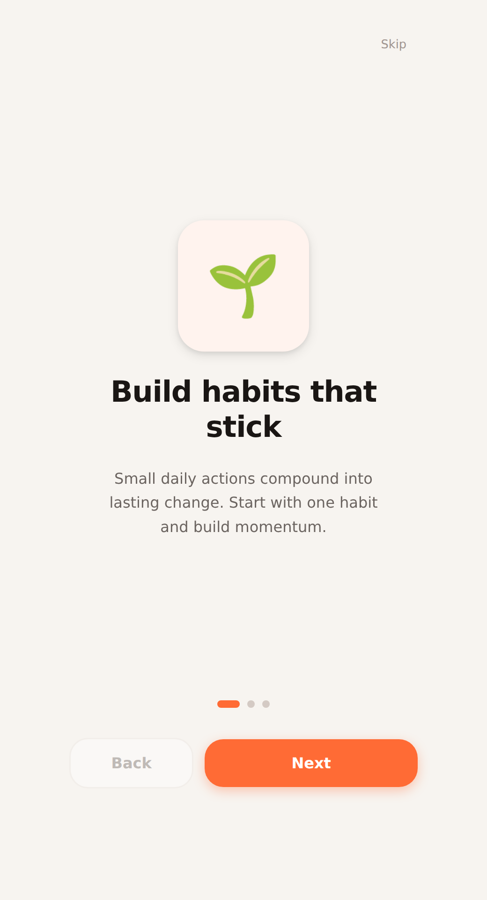 | 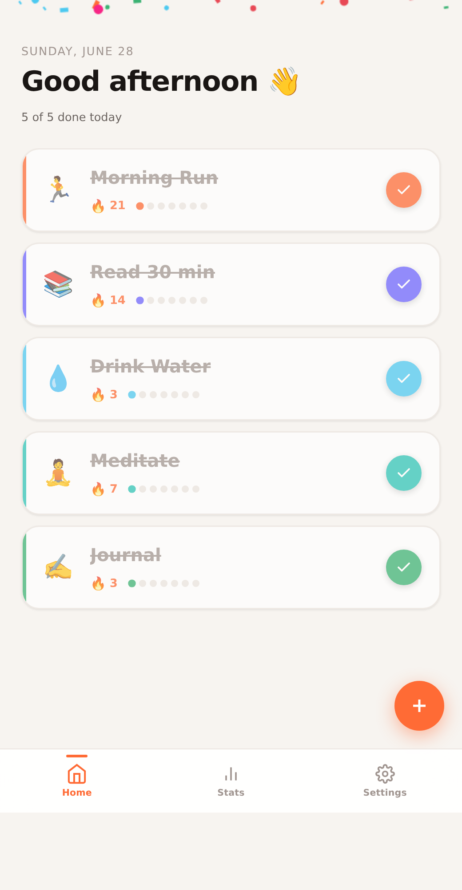 | 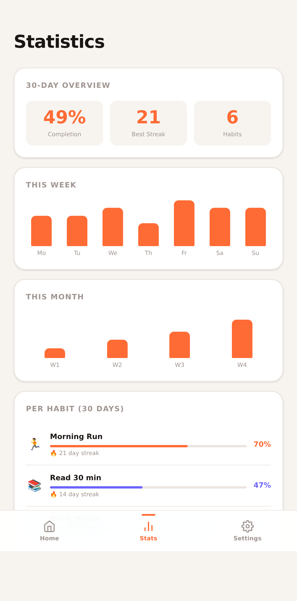 |

**The polished SVG-ring Pomodoro timer** the engine generated and verified, then iterated:

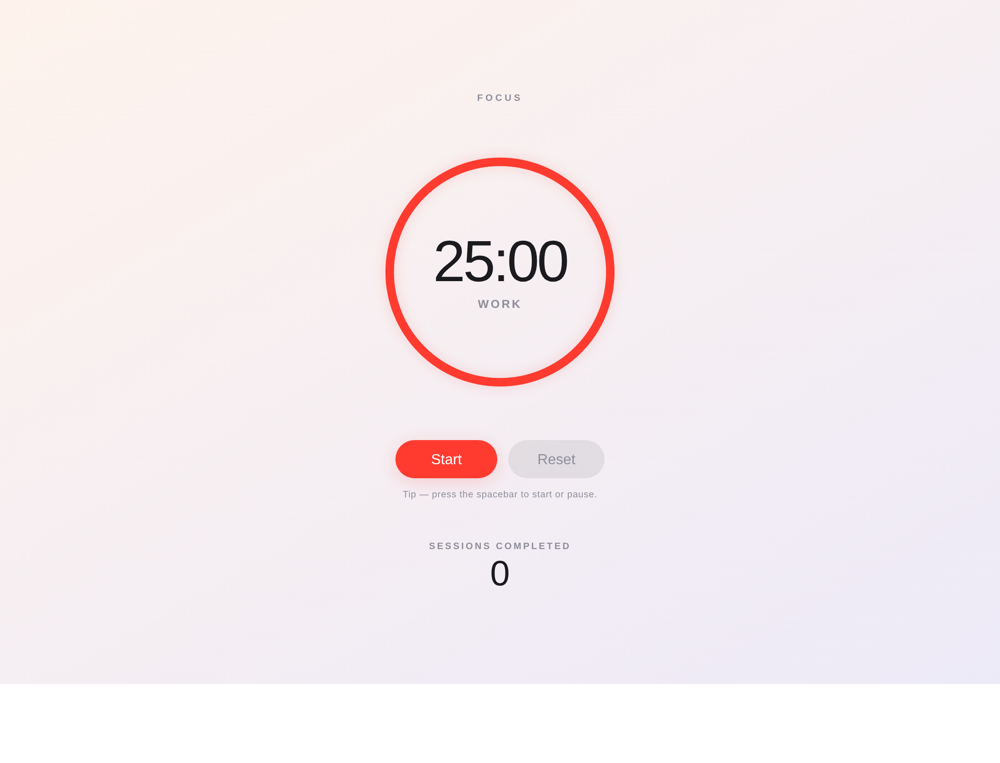

**Build tab** — pick spec/engine, toggle gates (review, test-first, approval), set budgets:


**Office (3D)** — a futuristic three.js scene where a little agent character works at a desk next to an **AI rig** (GPU rack). The fans spin and the GPU cards light up cyan whenever the frontier model or your local LLM is working; the whole scene animates live with the pipeline (idle → building → passed/failed):

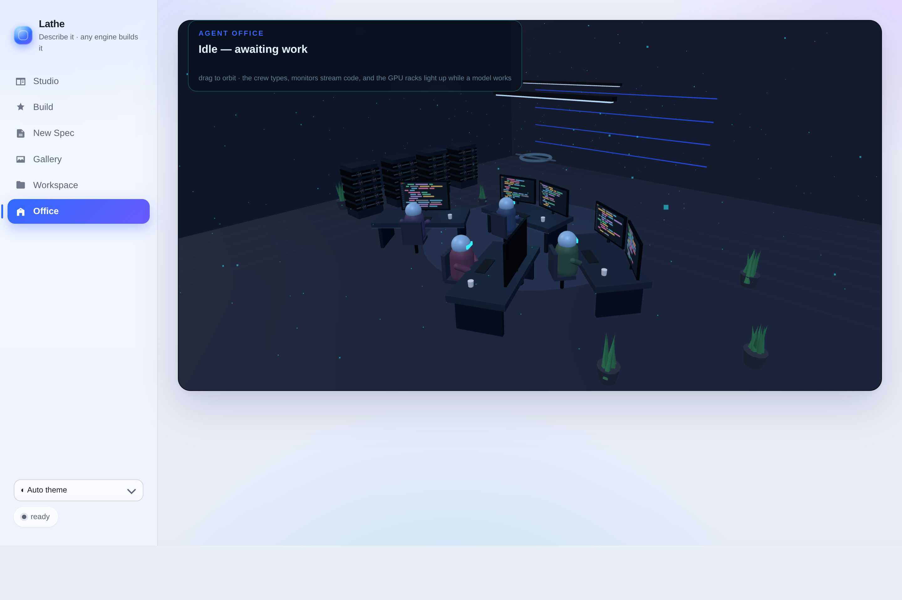

**Color-coded live log + budget meters** — passes/failures/gates at a glance, with live token & time budget bars:


**Live Workspace view** — watch files appear/change as the agent works, with a file viewer and live preview:


**Gallery** — browse built apps; the built app previews live in an embedded iframe:


**New Spec** — author, validate, and save a spec from the UI:


**An app built by the loop** (the Quick Notes demo, verified end-to-end):


## What's inside

| Capability | Module | Notes |
|---|---|---|
| **Verification gate** | `harness/verifier.py` | Runs build/test/lint; structured pass/fail. LLM-free, unit-tested. |
| **Reviewer / Sentry gate** | `harness/review.py` | Independent fresh-context agent(s) return a JSON verdict — `quality`, `bugs` (Sentry-style), or `a11y`. Run one (`--review`) or a **parallel panel** (`--review-panel quality,bugs,a11y`); the build passes only if **no** reviewer reports a blocker/major. |
| **Learn from itself** | `harness/memory.py` | Distills failures + reviewer findings into lessons (JSONL), injected into future builds. |
| **The loop** | `harness/agent.py` | Engine-agnostic: implement → verify → review → repair. **Diff-aware repair** (shows the last change's diff + failure delta) and **stall escalation** (a fresh-context fixer, optionally a stronger model). |
| **Test-first (red→green)** | `harness/testfirst.py` | `--test-first` derives the verification suite from the spec before building, then drives the build to green against it. |
| **Isolation** | `harness/isolation.py` | `directory` (default) or `worktree` (a git worktree off a base repo). |
| **Exec sandbox** | `harness/sandbox.py` | Commands run on the `--sandbox host` (default) or in a throwaway `--sandbox docker` container with the workspace bind-mounted. |
| **Approval gates** | `harness/approval.py` | `--approve-plan` / `--approve-build` pause for human sign-off (stdin in the CLI, or an Approve/Reject banner in the console). Rejecting **with a message** feeds it back as a targeted repair and the loop continues; a message-less rejection stops. |
| **Telemetry & budgets** | engines + `agent.py` | Tokens + wall-clock per build; `--token-budget` / `--deadline` stop the loop when exceeded. The console shows **live token & time budget meters** that fill as the build runs (amber near the limit, red over). |
| **Resumable builds** | `harness/checkpoint.py` | `--checkpoint PATH` writes a checkpoint each round; `--resume PATH` continues against the existing workspace (cumulative tokens/time carried forward). The console writes one automatically and shows a **Resume** button in the Gallery. |
| **Live run controls** | `harness/control.py` | **Pause** or **Cancel** a running build from the console; the loop stops at the next round boundary. Pause leaves a checkpoint, so it's resumable. |
| **3D Office** | `webui/office.js` (three.js) | A futuristic Office tab: an agent character works at a desk beside an **AI rig** whose fans spin and GPU cards glow cyan while a model runs. Animates with build state (idle / building / passed / failed), driven live by `/api/current`. three.js is vendored for offline use. |
| **CI** | `.github/workflows/ci.yml` | Runs the full test suite on Python 3.10–3.12 on every push and PR. |
| **Studio (live preview)** | `harness/server.py` + `webui/studio.js` | A Replit/Lovable-style surface: describe an app → it builds → **live preview** (Desktop / Mobile device frame, reload, open) with a **Run tests** chip; then **chat to iterate** (`/api/iterate` runs one engine turn on the workspace and re-verifies). A **project switcher** jumps between built apps, a **Stop** button cancels a run, and **version history + diffs** (`harness/versions.py`) snapshot every turn so you can review the colorized diff and **Restore** any version. Freeform prompts become first-class specs. |
| **Engines** | `harness/engines/` | `anthropic` (Claude Agent SDK), `local` (any OpenAI-compatible server — GLM / MiniMax / Qwen / …), or **`claude-cli`** — drives your installed, authenticated **Claude Code CLI** as the builder (no API key/SDK needed). |
| **Vision (image → UI)** | `harness/vision.py`, `harness/screenshot.py` | Reference a UI screenshot when building. **Two-stage:** a local **vision** model writes a design brief injected into the **coder**'s prompt. **Direct:** a multimodal coder reads the image — Claude Code reads the staged file, or a local VL model gets it inline (`--multimodal`). **Visual-match loop** (`--visual-check`): screenshot the build, vision-compare to the reference, repair the differences. CLI flags + Studio upload/toggles. |
| **Personas** | `harness/personas.py` | Specialist system prompts by `kind`: frontend design, backend rigor, **React/React Native**, **SwiftUI (Apple-level)**. |
| **Web console** | `harness/server.py` + `webui/` | Tabs: Build, **New Spec** (author specs), **Gallery** (preview built apps), and a **live Workspace view** (watch files appear/change as the agent works). Stdlib only. See `docs/screenshots/`. |
| **Design checks** | `checks/` | Headless Playwright + axe-core + Lighthouse, wired as verification commands. |

## Self-improving loop, in one command

```bash
# Build with Claude, sentry bug-hunt gate, and learning enabled
export ANTHROPIC_API_KEY=sk-ant-...
appbuilder specs/todo-cli.yaml -w workspaces/todo \
    --review --review-focus bugs --learn

# Same loop on a local model via Ollama
appbuilder specs/landing-page.yaml -w workspaces/landing \
    --engine local --base-url http://localhost:11434/v1 --model qwen2.5-coder \
    --review --learn

# Isolate the build in a git worktree off the current repo
appbuilder specs/todo-cli.yaml -w /tmp/wt --isolation worktree --base-repo . --cleanup

# No model, no key — just run the verification gate
appbuilder specs/web-dashboard.yaml -w workspaces/dash --check-only
```

Flags: `--engine {anthropic,local}`, `--model`, `--base-url`, `--review`,
`--review-focus {quality,bugs}`, `--reviewer-model`, `--learn`, `--memory PATH`,
`--isolation {directory,worktree}`, `--base-repo`, `--cleanup`,
`--max-repairs`, `--max-turns`, `--check-only`, `--no-echo`.

## Web console

```bash
appbuilder-web            # http://127.0.0.1:8765
```

Pick a spec, choose engine/model, toggle the reviewer/sentry gate and learning,
and watch the build stream live (SSE). The UI itself dogfoods the design
persona — a ChatGPT / Hermes-style sidebar shell, a cohesive token system,
automatic light/dark, keyboard focus, and reduced-motion support.

## Studio — build & iterate like Replit / Lovable

The **Studio** tab is the conversational surface:

1. **Describe** the app (or pick a kind). The harness builds it, then **verifies** it.
2. **Watch it live** in the preview pane — toggle **Desktop / Mobile** (a phone frame),
   reload, or open in a new tab. Hit **Run tests** to re-run the gate any time.
3. **Chat to iterate** — "add a dark-mode toggle", "make the ring teal". Each message
   runs one engine turn against the workspace and re-verifies; the preview reloads.
4. **Switch & stop** — the project switcher jumps between built apps without leaving
   Studio; **Stop** cancels an in-flight run (immediately killing the engine turn for a
   change). Reloading the page mid-run re-attaches to the live job.
5. **History & diff** — every turn is snapshotted. The **Diff** tab shows a colorized
   per-version diff of what changed, and **Restore** rolls back to any earlier version
   (non-destructively — the current state is saved first).

The console wears a modern **glassmorphic** theme: a soft gradient-mesh backdrop,
translucent frosted cards, and a gradient-accent primary — premium, with automatic
light/dark and reduced-motion support.

Choose your engine right in Studio:

- **Claude Code (CLI)** — drives your installed, authenticated `claude` CLI. No API key,
  no SDK; *literally* plugging Claude Code in as the builder. (Set `$CLAUDE_CLI_BIN` to
  point at a non-default binary.)
- **Local** — any OpenAI-compatible server (Ollama / LM Studio / vLLM). Presets for
  **GLM**, **MiniMax**, and **Qwen Coder**; the model id + base URL are editable to match
  whatever your server exposes.

```bash
# Same thing from the CLI — build with your Claude Code login as the engine:
appbuilder specs/landing-page.yaml -w workspaces/landing --engine claude-cli

# …or a local model:
appbuilder specs/landing-page.yaml -w workspaces/landing \
    --engine local --base-url http://localhost:11434/v1 --model glm-4
```

> **Native mobile (RN / SwiftUI):** the in-browser preview covers web and
> responsive/RN-web in a phone frame. True React Native and SwiftUI builds still need
> their native toolchains (Node/Expo, macOS/Xcode) to *run* — the harness drives the
> build the same way everywhere; only the run/preview surface differs.

## Match a reference UI from an image (vision)

Drop a screenshot of a UI you like and the harness will build to match it. Two paths
(`harness/vision.py`, `--reference-image`, or the Studio "Reference UI image" upload):

1. **Two-stage (recommended, fully local):** a **vision** model (e.g. `qwen2.5-vl`,
   `llava`, `minicpm-v` on your local server) writes an implementation-ready *design
   brief* from the image; that brief is injected into the prompt for a strong, dedicated
   **coder** model (e.g. `qwen2.5-coder`). Each model is specialised → best quality.
   Set a Vision model in Studio, or `--vision-model qwen2.5-vl --vision-base-url …`.
2. **Single multimodal model:** one vision+code model reads the image directly (no separate
   describe step). The **Claude Code** engine reads the staged file; a **local** vision-capable
   model gets the image attached to its first turn with `--multimodal`.

3. **Visual-match loop (`--visual-check`):** after building, the harness screenshots the result
   with a headless Chromium, asks the vision model how it differs from the reference, and feeds
   those differences back as a repair — up to `max_visual_repairs` times. Closes the loop on
   visual fidelity. (`harness/screenshot.py` + `vision.compare_ui`.)

```bash
# Two-stage + visual-match loop: vision model describes & QAs, coder builds
appbuilder specs/app.yaml -w ws/app --engine local --model qwen2.5-coder \
    --reference-image design.png --vision-model qwen2.5-vl --visual-check

# Single local multimodal model reads the image itself
appbuilder specs/app.yaml -w ws/app --engine local --model qwen2.5-vl \
    --reference-image design.png --multimodal
```

Below: from a single prompt **plus the Streak home screen as a reference image**, the
Claude Code engine built a *different* app (a water tracker) that adopts the reference's
visual language — warm background, left-accent cards, emoji headers, the circular ring,
the 🔥 streak with weekly dots, and the bottom tab bar:

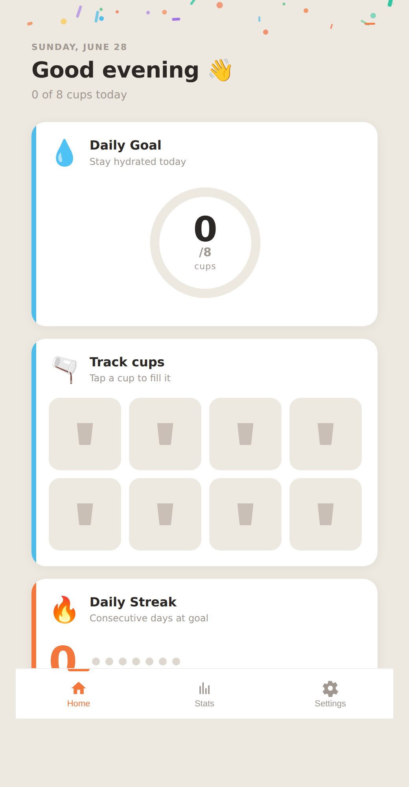

## Native targets — React Native & SwiftUI

The persona for `kind: react-native` enforces typed components, design tokens,
native feel, and a11y; `kind: swiftui` enforces HIG, VoiceOver/Dynamic Type,
light+dark, and idiomatic state. Example specs: `specs/react-native-app.yaml`,
`specs/swiftui-app.yaml`.

> Quality is only as strong as the verification you give it. Make the gate real:
> React/RN → `tsc --noEmit`, `eslint`, `vitest`/`jest`; SwiftUI → `swift test`
> or `xcodebuild test`. **SwiftUI builds require a macOS/Xcode toolchain**, and
> React Native builds require Node — those commands won't run on a bare Linux
> box; the harness logic is the same everywhere, only the toolchain differs.

## Design as a hard gate

`specs/landing-page.yaml` verifies design tokens, responsive `@media`, semantic
landmarks, and a single `<h1>` with stdlib Python (runs anywhere). For richer
checks, `specs/web-dashboard.yaml` wires the `checks/` scripts:

```yaml
verification:
  - name: a11y
    command: "node ../../checks/a11y_audit.mjs index.html"   # axe-core, fails on critical/serious
  - name: lighthouse
    command: "node ../../checks/lighthouse_audit.mjs index.html"   # score budgets
```

See `checks/README.md` (needs Node + Chromium).

## Robustness model

- **Deterministic gate, not vibes** — verification runs between turns; the agent can't self-declare success.
- **Independent second opinion** — the reviewer/sentry runs in a *fresh* engine context and reads the code itself.
- **Bounded autonomy** — separate repair budgets for verification and review; capped agentic turns.
- **Isolation** — builds land in an ephemeral dir or a throwaway git worktree; `git push` is blocked inside the sandbox.
- **Reviewable output** — work is a diff you inspect; nothing is pushed.

## Setup & tests

```bash
pip install -e .            # Claude engine
pip install -e ".[local]"   # + local-LLM engine (openai client)
pip install -e ".[dev]"     # + tests
pytest                      # 130 offline tests; no API key, no network
```

The trust-critical pieces (verifier, spec, isolation, memory, review parsing,
the loop via a fake engine, the web helpers) are fully unit-tested offline. The
two live model paths need a key or a local server to exercise end-to-end.

## Layout

```
harness/
  verifier.py spec.py personas.py prompts.py        # spec + gates + prompts (LLM-free core)
  memory.py review.py isolation.py                   # learning, reviewer gate, isolation
  permissions.py localtools.py tools.py             # sandbox + tools
  config.py agent.py cli.py server.py               # config, the loop, CLIs, web console
  engines/ base.py anthropic_engine.py local_engine.py
webui/        index.html styles.css app.js          # clean build console
specs/        todo-cli, landing-page, web-dashboard, react-native-app, swiftui-app
checks/       a11y_audit.mjs lighthouse_audit.mjs   # design gate templates
tests/        verifier, spec, localtools, personas, isolation, memory, review, loop, server
```

## Next steps

- Container isolation (Docker) in addition to worktrees.
- A reflection step that asks the model to summarize its own lessons (richer than the mechanical distillation).
- Persisted plan artifacts and per-file staleness checks.
- Cost/time budgets surfaced from engine usage and enforced in the loop.
